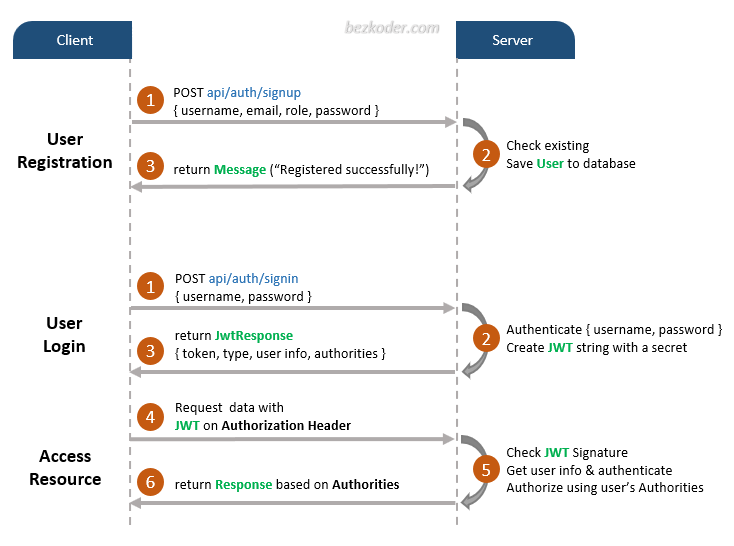
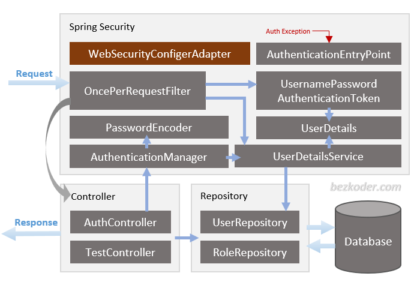

# Java 41 — Spring Security & JWT Authentication

A focused Spring Boot learning project that demonstrates **stateless authentication and role-based authorization with Spring Security and JWT**.

The project covers the complete request flow from user registration and login to JWT generation, JWT validation, Spring Security filter-chain processing, authentication context creation, and role-protected REST endpoints.

> This project is part of the `java-backend-spring-boot-spring-cloud` learning repository and is based on the Bezkoder Spring Boot JWT authentication example, with additional local setup and security-response improvements.

---

## Features

- User registration
- User login
- JWT access-token generation
- JWT validation on incoming requests
- Stateless Spring Security configuration
- BCrypt password hashing
- Role-Based Access Control (RBAC)
- Method-level authorization with `@PreAuthorize`
- Custom JWT authentication filter
- Custom `401 Unauthorized` handling
- Custom `403 Forbidden` handling
- Spring Data JPA persistence
- Many-to-Many User–Role relationship
- Jakarta Bean Validation
- MySQL database
- Docker Compose development database

---

## Technology Stack

| Technology | Version / Usage |
|---|---|
| Java | 17 |
| Spring Boot | 3.1.0 |
| Spring Security | Authentication & authorization |
| Spring Web | REST API |
| Spring Data JPA | Persistence |
| Hibernate | ORM |
| Jakarta Validation | Request validation |
| JJWT | 0.11.5 |
| BCrypt | Password hashing |
| MySQL | Relational database |
| Docker Compose | Local MySQL environment |
| Maven | Build and dependency management |

---

## Core Concepts Practiced

This project is intended to reinforce the following Spring Security concepts:

- Authentication
- Authorization
- RBAC
- `SecurityFilterChain`
- `AuthenticationManager`
- `AuthenticationProvider`
- `DaoAuthenticationProvider`
- `UserDetails`
- `UserDetailsService`
- `SecurityContext`
- `OncePerRequestFilter`
- Bearer Token authentication
- JWT claims and expiration
- BCrypt password encoding
- Stateless REST APIs
- `401 Unauthorized` vs `403 Forbidden`
- JPA entity relationships
- Many-to-Many mapping

---

## Project Structure

```text
src/main/java/com/bezkoder/springjwt
├── controllers
│   ├── AuthController.java
│   └── TestController.java
├── models
│   ├── ERole.java
│   ├── Role.java
│   └── User.java
├── payload
│   ├── request
│   │   ├── LoginRequest.java
│   │   └── SignupRequest.java
│   └── response
│       ├── JwtResponse.java
│       └── MessageResponse.java
├── repository
│   ├── RoleRepository.java
│   └── UserRepository.java
└── security
    ├── WebSecurityConfig.java
    ├── jwt
    │   ├── AuthEntryPointJwt.java
    │   ├── AuthTokenFilter.java
    │   └── JwtUtils.java
    └── services
        ├── UserDetailsImpl.java
        └── UserDetailsServiceImpl.java
```

---

## Authentication Flow

The JWT authentication flow is:

```text
Client
  │
  │ POST /api/auth/signin
  ▼
AuthController
  │
  ▼
AuthenticationManager
  │
  ▼
DaoAuthenticationProvider
  │
  ├── UserDetailsService
  └── PasswordEncoder (BCrypt)
  │
  ▼
Authenticated User
  │
  ▼
JwtUtils
  │
  ▼
JWT Access Token
```

For protected requests:

```text
HTTP Request
  │
  │ Authorization: Bearer <JWT>
  ▼
Spring Security Filter Chain
  │
  ▼
AuthTokenFilter
  │
  ├── Extract JWT
  ├── Validate JWT
  ├── Load UserDetails
  └── Create Authentication
  │
  ▼
SecurityContext
  │
  ▼
@PreAuthorize
  │
  ▼
Controller
```

The original architecture diagrams are also included in this project:





---

## Roles

The application supports three roles:

```text
ROLE_USER
ROLE_MODERATOR
ROLE_ADMIN
```

The relationship between users and roles is modeled as **Many-to-Many**.

After the schema has been created, initialize the role table:

```sql
INSERT INTO roles(name) VALUES('ROLE_USER');
INSERT INTO roles(name) VALUES('ROLE_MODERATOR');
INSERT INTO roles(name) VALUES('ROLE_ADMIN');
```

---

## API Endpoints

### Authentication

| Method | Endpoint | Description | Authentication |
|---|---|---|---|
| POST | `/api/auth/signup` | Register a new user | Public |
| POST | `/api/auth/signin` | Authenticate and receive JWT | Public |

### Authorization Test Endpoints

| Method | Endpoint | Required Role |
|---|---|---|
| GET | `/api/test/all` | Public |
| GET | `/api/test/user` | USER, MODERATOR or ADMIN |
| GET | `/api/test/mod` | MODERATOR |
| GET | `/api/test/admin` | ADMIN |

---

## Running the Project

### Prerequisites

Make sure the following tools are installed:

- JDK 17+
- Docker Desktop
- Maven, or use the included Maven Wrapper
- Postman or another REST client

### 1. Start MySQL

From the project directory:

```bash
docker compose up -d
```

The provided Compose file starts a MySQL 8.4 development container and exposes MySQL on host port `3307`.

Check the container:

```bash
docker compose ps
```

### 2. Start the Spring Boot application

Windows:

```bash
mvnw.cmd spring-boot:run
```

Linux/macOS:

```bash
./mvnw spring-boot:run
```

The API runs by default at:

```text
http://localhost:8080
```

### 3. Initialize roles

Once Hibernate creates the tables, execute:

```sql
INSERT INTO roles(name) VALUES('ROLE_USER');
INSERT INTO roles(name) VALUES('ROLE_MODERATOR');
INSERT INTO roles(name) VALUES('ROLE_ADMIN');
```

---

## Example Requests

### Register a USER

```http
POST /api/auth/signup
Content-Type: application/json
```

```json
{
  "username": "testuser",
  "email": "testuser@example.com",
  "password": "StrongPassword123!",
  "role": ["user"]
}
```

Supported registration role values:

```text
user
mod
admin
```

If the role field is omitted, the application assigns `ROLE_USER`.

### Sign in

```http
POST /api/auth/signin
Content-Type: application/json
```

```json
{
  "username": "testuser",
  "password": "StrongPassword123!"
}
```

A successful login returns a JWT access token together with user information and granted roles.

### Call a protected endpoint

```http
GET /api/test/user
Authorization: Bearer <JWT_TOKEN>
```

---

## 401 vs 403

The project explicitly distinguishes authentication and authorization failures.

### 401 Unauthorized

Returned when authentication cannot be established, for example:

- Missing JWT
- Invalid JWT
- Malformed JWT
- Expired JWT

Conceptually:

```text
No valid authentication
        ↓
AuthenticationEntryPoint
        ↓
401 Unauthorized
```

### 403 Forbidden

Returned when the user is authenticated but does not have the role required by the endpoint.

Example:

```text
ROLE_USER token
        ↓
GET /api/test/admin
        ↓
Authenticated but not authorized
        ↓
AccessDeniedHandler
        ↓
403 Forbidden
```

The project contains an explicit `AccessDeniedHandler` configuration so role failures return `403 Forbidden` rather than being confused with authentication failures.

---

## Authorization Matrix

| Request | Expected Result |
|---|---|
| No token → `/api/test/user` | 401 Unauthorized |
| Invalid token → `/api/test/user` | 401 Unauthorized |
| Valid USER token → `/api/test/user` | 200 OK |
| Valid USER token → `/api/test/admin` | 403 Forbidden |
| Valid MODERATOR token → `/api/test/mod` | 200 OK |
| Valid ADMIN token → `/api/test/admin` | 200 OK |

---

## Security Configuration

The application is configured as a stateless REST API:

```java
.sessionManagement(session ->
    session.sessionCreationPolicy(SessionCreationPolicy.STATELESS)
)
```

CSRF is disabled for this token-based API, and JWT processing is performed before Spring Security's `UsernamePasswordAuthenticationFilter`.

Method-level authorization is enabled with:

```java
@EnableMethodSecurity
```

Role checks are applied using expressions such as:

```java
@PreAuthorize("hasRole('ADMIN')")
```

---

## Password Security

Passwords are never stored as plain text by the application.

Spring Security's `BCryptPasswordEncoder` is used:

```java
@Bean
public PasswordEncoder passwordEncoder() {
    return new BCryptPasswordEncoder();
}
```

During login, the authentication provider compares the submitted password with the BCrypt hash stored in the database.

---

## Configuration and Secrets

The current project is a learning implementation. For production-style configuration, database credentials and JWT signing keys should **not** be committed directly to source control.

Prefer environment variables or an external secrets-management solution, for example:

```properties
spring.datasource.username=${DB_USERNAME}
spring.datasource.password=${DB_PASSWORD}

bezkoder.app.jwtSecret=${JWT_SECRET}
bezkoder.app.jwtExpirationMs=${JWT_EXPIRATION_MS:86400000}
```

For real-world systems, use a sufficiently strong signing key and manage secret rotation appropriately.

---

## Current Scope

Implemented in the current project:

- Spring Security authentication
- JWT access token
- Role-based authorization
- BCrypt
- UserDetails / UserDetailsService
- AuthenticationManager / AuthenticationProvider
- SecurityFilterChain
- OncePerRequestFilter
- SecurityContext
- JPA
- Many-to-Many User–Role mapping
- Validation
- 401 / 403 handling
- Stateless API
- Dockerized MySQL development database

Not yet implemented in this project:

- Refresh Token
- Logout / token revocation
- Global exception handling
- OpenAPI / Swagger
- Flyway or Liquibase
- Testcontainers
- Security integration tests
- Environment-based secret management
- Stronger JWT key-management strategy
- Audit logging
- Rate limiting

These are intended as future extensions after the core Spring Security and JWT flow is fully understood.

---

## Planned Enhancements

The next learning milestones are:

1. Refresh Token lifecycle
2. Logout and token revocation strategy
3. Global exception handling
4. OpenAPI / Swagger documentation
5. PostgreSQL Docker environment
6. Flyway or Liquibase migrations
7. Testcontainers
8. Spring Security integration tests
9. Environment variables and secret management
10. Stronger JWT signing-key management
11. Audit logging
12. Rate limiting

---

## Reference

This learning project is based on the following Bezkoder example:

- **Bezkoder — Spring Boot JWT Authentication with Spring Security & Spring Data JPA**
- Source repository: `bezkoder/spring-boot-spring-security-jwt-authentication`

The code has been used as a learning baseline and extended locally to practice Spring Security behavior, Docker-based database setup, and explicit `401 Unauthorized` / `403 Forbidden` handling.

---

## Learning Objective

The goal of this project is not only to make JWT authentication work, but to understand **how Spring Security processes an HTTP request internally**:

```text
Request
  → Security Filter Chain
  → JWT Filter
  → UserDetailsService
  → Authentication
  → SecurityContext
  → Authorization
  → Controller
```

This provides the foundation for building more advanced authentication and authorization architectures in later Spring Boot and Spring Cloud projects.
